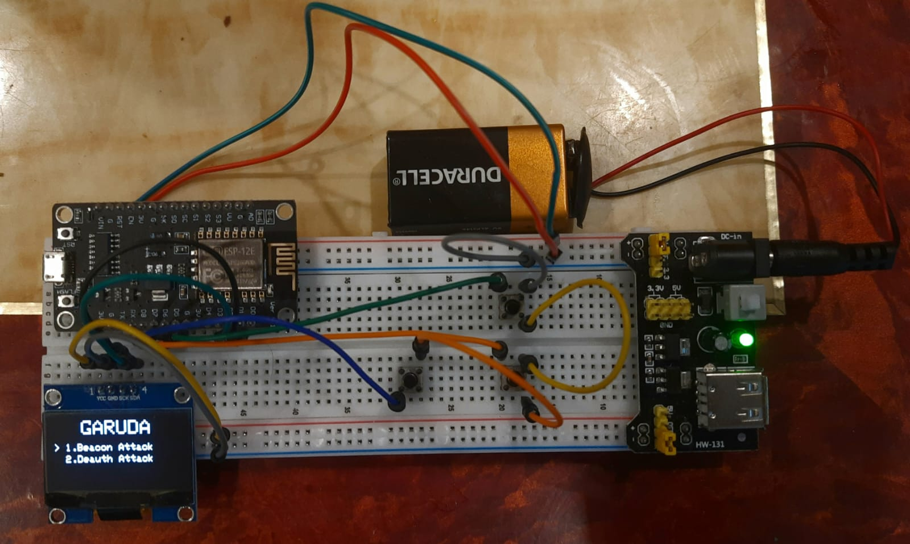

# 🦅 Project GARUDA
### **Handheld Hardware-Software Exploit Framework**


**GARUDA** is a portable, standalone security research platform that fuses custom hardware with bare-metal software control. Built on the **ESP8266** architecture, it serves as a tactical gateway for multi-vector exploits, ranging from wireless reconnaissance to physical peripheral manipulation.




---

## 🛑 LEGAL DISCLAIMER
> **WARNING:** Project GARUDA is intended for **educational purposes and authorized security auditing only.** Unauthorized use against networks or devices without explicit permission is illegal. The developer assumes no liability for any damage or legal consequences caused by the misuse of this framework. **Always operate within ethical and legal boundaries.**

---

---

## ⚡ Current Capabilities
### **Wireless Auditing: 802.11 Beacon Spam**
The initial module focuses on saturating the 2.4GHz spectrum to test client-side resilience and network list handling.
    [Blog link](https://svalanukonda.github.io/blogsWebsite/posts/wifi_beacon_attack_the_garuda_project/)
* **SSID Virtualization:** Clones a target network into 10+ unique, invisible variations.
* **Invisible Padding:** Uses trailing space injection to force unique hashes while appearing identical to the end-user.
* **BSSID Spoofing:** Dynamic MAC address (BSSID) randomization for each clone.
* **Unified Control:** Click to launch the attack; long-press (800ms) to cancel and return to safety.

---


## 🏗️ Framework Architecture
GARUDA is a unified ecosystem where custom hardware meets low-level exploit logic. It is designed to be completely autonomous, requiring no external computer once deployed in the field.

### **Hardware Stack**
* **Microcontroller:** ESP8266 (NodeMCU / Wemos D1 Mini) providing core processing and radio frequency capabilities.
* **Display:** 0.96" SSD1306 OLED (128x64) for real-time telemetry and exploit monitoring.
* **Interface:** 3-Button tactical navigation system with interrupt-driven response logic.
* **Power:** MB102 Breadboard Power Supply for stable 3.3V/5V regulation during high-intensity operations.


---

## 🔌 Hardware Connection Map
To build the GARUDA framework, wire your breadboard according to the following GPIO configuration:

| Component | ESP8266 Pin | Physical Function |
| :--- | :--- | :--- |
| **OLED SDA** | **D2** (GPIO 4) | I2C Data |
| **OLED SCL** | **D1** (GPIO 5) | I2C Clock |
| **Button UP** | **D5** (GPIO 14) | Menu Navigation (Previous) |
| **Button DOWN** | **D6** (GPIO 12) | Menu Navigation (Next) |
| **Button SELECT**| **D7** (GPIO 13) | **Execute (Click) / Cancel (Long-press)** |


## 🗺️ Multi-Vector Exploit Roadmap
GARUDA is an evolving platform designed to expand into a universal security multi-tool:

* **[Wireless]** Deauthentication, Probe Sniffing, and Handshake monitoring.
* **[Physical]** IR Signal Grabbing/Replay for physical access control auditing.
* **[Wired]** Serial/UART Bridge for monitoring local debug ports on IoT devices.
* **[Logic]** I2C Scanning and peripheral identification for hardware reverse engineering.

---

## ⚙️ Installation
1.  Setup **Arduino IDE** with the **ESP8266 Core**.
2.  Install required libraries: `Adafruit_SSD1306`, `Adafruit_GFX`, and `OneButton`.
3.  Clone the repository:
    ```bash
    git clone https://github.com/SValanukonda/GARUDA.git
    ```
4.  Flash the firmware and assemble the hardware on your breadboard.

---

## 🏷️ Tags
`#CyberSecurity` `#ESP8266` `#HardwareHacking` `#EthicalHacking` `#EmbeddedSystems` `#ExploitFramework` `#InfoSec` `#WirelessSecurity`

---
**Developed by:** Sarath Valanukonda

**Project Status:** Active Development (Alpha)